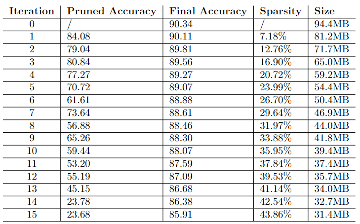
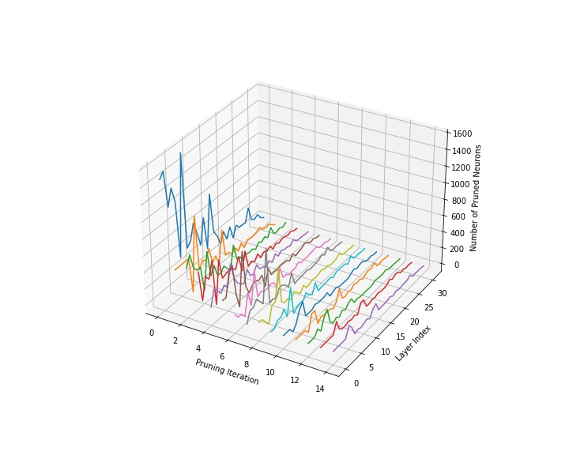
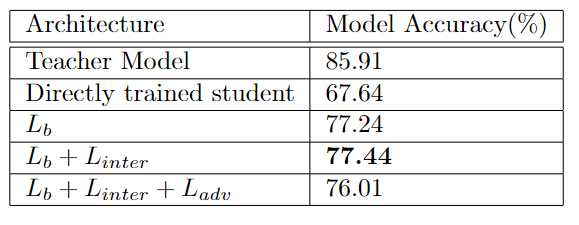
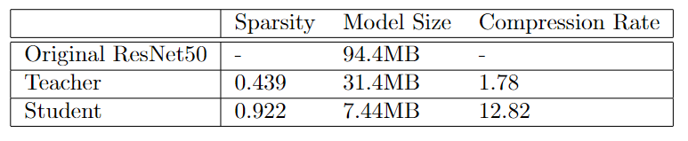

## CNN Model Compression with Pruning & Knowledge Distillation
In this project we combined weight pruning and knowledge distillation techniques to conduct model compression on ResNet50 model. The experimental task is image classification with CIFAR10 dataset. Our final result achieved a compression rate of 12.82 with 77.44% validation accuracy. 

### Pruning

In the first step, we pruned the pretrained ResNet50 through weight pruning. We conducted iterative pruning for 15 iterations. In each iteration we first prune the convolutional layers based on Apoz scores, then finetune the pruned model to convergence. The results of iterative pruning is shown below:   

Number of Neurons pruned in each layer over iterations:

### Knowledge Distillation

To further compress the model, we train a small student ResNet50 network through knowledge distillation to learn from the teacher network, which is the pruned model in step 1. The training loss is composed of three parts: backbone loss, intermediate layer loss, and adversarial training loss. The loss function is 
$$L = \lambda_1L_{backbone} + \lambda_2L_{intermediate} + \lambda_3L_{adversarial}$$
where $\lambda_1, \lambda_2, \lambda_3$ are hyperparameters that can be tuned. The experimental results are shown below: 

Finally, the model compression result is shown below:

### Repository Description
- `model.py`: defines ResNet model architecture
- `train_base_model.py`: train baseline resnet50 model
- `prune.py`: contains pruning methods
- `prune_model.py`: training procedure for iterative pruning
- `knowledge_distillation.py`: contains KD methods and training procedures
- `model`: contains best accuracy models for pruning and knowledge distillation

### Example Commands
- `python train_base_model.py --save_folder=./model/base_model --model_path=./model/pretrained_resnet50.h5`
- `python prune_model.py --prune_iter=15`
- `python knowledge_distillation.py --root_folder=./model/pruned_model/iter15 --lambda1=0.7, --lambda2=0.3, --lambda3=0.2, --regressor_name=conv1x1`
- `python evaluate_model.py --model_path=./model/base_model/model.h5`
- `python plot_train_history.py --history_path=./model/prued_model/iter1/history.json`

### References
- Aghli N, Ribeiro E. Combining Weight Pruning and Knowledge Distillation for CNN Compression[C]//Proceedings of the IEEE/CVF Conference on Computer Vision and Pattern Recognition. 2021: 3191-3198.https://openaccess.thecvf.com/content/CVPR2021W/EVW/papers/Aghli_Combining_Weight_Pruning_and_Knowledge_Distillation_for_CNN_Compression_CVPRW_2021_paper.pdf
- Hu, Hengyuan, et al. "Network trimming: A data-driven neuron pruning approach towards efficient deep architectures." arXiv preprint arXiv:1607.03250 (2016). https://arxiv.org/pdf/1607.03250.pdf 
- X. Jin, B. Peng, Y. Wu, Y. Liu, J. Liu, D. Liang, J. Yan, and X. Hu, “Knowledge distillation via route constrained optimization,” ICCV, 2019. https://arxiv.org/pdf/1904.05100.pdf
- Wang, Lin, and Kuk-Jin Yoon. "Knowledge distillation and student-teacher learning for visual intelligence: A review and new outlooks." IEEE Transactions on Pattern Analysis and Machine Intelligence (2021). https://ieeexplore.ieee.org/stamp/stamp.jsp?tp=&arnumber=9340578
- Ahn, Sungsoo, et al. "Variational information distillation for knowledge transfer." Proceedings of the IEEE/CVF Conference on Computer Vision and Pattern Recognition. 2019. https://openaccess.thecvf.com/content_CVPR_2019/papers/Ahn_Variational_Information_Distillation_for_Knowledge_Transfer_CVPR_2019_paper.pdf 

